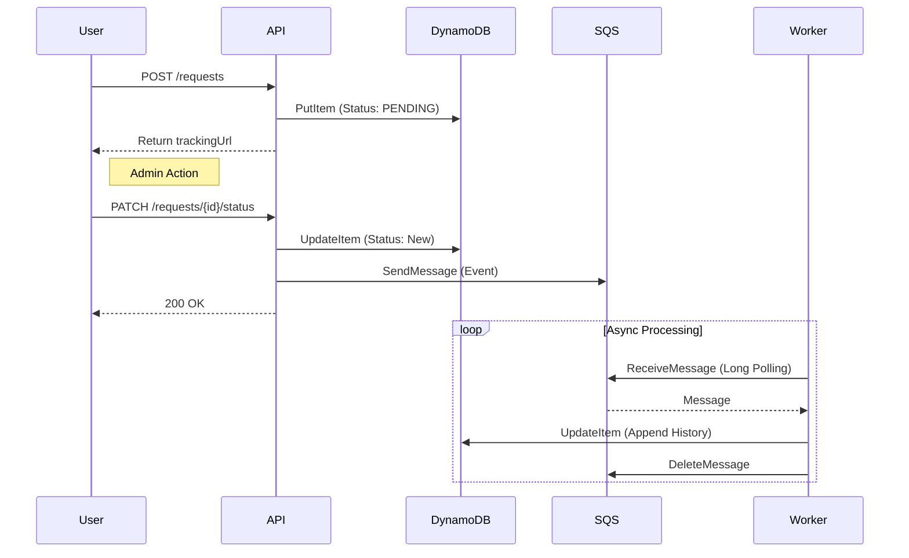

# request-tracker-localstack-lab

A minimal LocalStack lab to learn an AWS-style async workflow:
- **Go HTTP API**: Creates and updates requests.
- **DynamoDB**: Stores request data.
- **SQS**: Queues status change events.
- **Worker**: Polls SQS and appends "notification processed" history to DynamoDB.

No UI. Everything is verified via `curl` and logs.

---

## Architecture

1. **User** creates a request via API (`PENDING`).
2. **Admin** updates status via API (`IN_PROGRESS`). API pushes an event to **SQS**.
3. **Worker** polls SQS, receives the event, and updates **DynamoDB** history asynchronously.



---

## Prerequisites

- **LocalStack** (AWS Emulator)
- **Go**
- **OpenTofu** (`tofu`) or Terraform
- **AWS CLI** (`aws`)
- **Make**

---

## Setup

### 1. Terraform Variables

Create `infra/envs/local/terraform.tfvars`.

```hcl
localstack_endpoint = "${YOUR_LOCALSTACK_ENDPOINT}"
```

### 2. App Environment

Create `backend/.env`.

```bash
# App Config
APP_ENV=local

# AWS Config (LocalStack)
AWS_REGION=${YOUR_AWS_REGION}
AWS_ACCESS_KEY_ID=${YOUR_ACCESS_KEY_ID}         # e.g. test
AWS_SECRET_ACCESS_KEY=${YOUR_SECRET_ACCESS_KEY} # e.g. test

# Infrastructure Endpoints
DYNAMODB_ENDPOINT=${YOUR_DYNAMODB_ENDPOINT}
SQS_ENDPOINT=${YOUR_SQS_ENDPOINT}

# Application Secrets
# Used for: PATCH /requests/{id}/status
ADMIN_TOKEN=${YOUR_ADMIN_TOKEN}

# Base URL for tracking links (POST /requests response)
APP_PUBLIC_BASE_URL=http://localhost:8080
```

---

## Commands

**Provision / Destroy Infrastructure:**
```bash
make infra-apply
make infra-destroy
```

**Run Processes:**
Open two separate terminals for these commands:
```bash
make run-backend
make run-worker
```

---

## Smoke Test (Step-by-Step)

Perform these steps in a new terminal (Terminal C).
Ensure you have set the same `ADMIN_TOKEN` in your environment or replace it in the commands below.

### 0. Reset State (Optional)
```bash
make infra-destroy
make infra-apply
```

### 1. Start Processes
Ensure `make run-backend` (Terminal A) and `make run-worker` (Terminal B) are running.

### 2. Health Check
```bash
curl -s http://localhost:8080/health
# Expected: ok
```

### 3. Create Request
```bash
curl -s -X POST http://localhost:8080/requests \
  -H 'Content-Type: application/json' \
  -d '{"title":"test-job"}'
```

**Expected JSON:**
```json
{
  "requestId": "...",
  "title": "test-job",
  "createdAt": "...",
  "trackingUrl": "http://localhost:8080/requests/<id>?t=<token>"
}
```
> **Action:** Copy `requestId` as `<REQUEST_ID>` and `trackingUrl` as `<TRACKING_URL>`.

### 4. GET via Tracking URL
```bash
curl -s "<TRACKING_URL>"
```
**Expected:** `"status": "PENDING"`

### 5. PATCH Status (Admin Action)
Trigger the async workflow.

```bash
# Replace <REQUEST_ID> and <ADMIN_TOKEN>
curl -s -X PATCH "http://localhost:8080/requests/<REQUEST_ID>/status" \
  -H "Authorization: Bearer ${YOUR_ADMIN_TOKEN}" \
  -H "Content-Type: application/json" \
  -d '{"status":"IN_PROGRESS"}'
```

**Expected JSON:**
```json
{
  "requestId": "...",
  "newStatus": "IN_PROGRESS",
  "changedAt": "...",
  "eventId": "..."
}
```

**Check Worker Logs (Terminal B):**
```text
processed eventId=... requestId=... newStatus=IN_PROGRESS
```

### 6. Verify Update
```bash
curl -s "<TRACKING_URL>"
```
**Expected:** `"status": "IN_PROGRESS"`

### 7. Verify DynamoDB History (Optional)
Check raw data in DynamoDB to verify the worker appended the history.

```bash
# Replace ${YOUR_LOCALSTACK_ENDPOINT}
aws --endpoint-url=${YOUR_LOCALSTACK_ENDPOINT} dynamodb get-item \
  --table-name Requests \
  --key '{"PK":{"S":"REQ#<REQUEST_ID>"}}'
```

**Expected fields:**
- `statusHistory` (List)
- `notifiedAt` (String)
- `lastEventId` (String)

---

## Key Concepts

- **SQS Long Polling:** The worker uses `WaitTimeSeconds: 10`. This reduces empty responses and API costs by keeping the connection open until a message arrives.
- **Visibility Timeout:** If the worker crashes while processing a message, the message becomes visible again after the timeout (30s) so another worker can retry it.

---

## Cleanup

```bash
make infra-destroy
```
